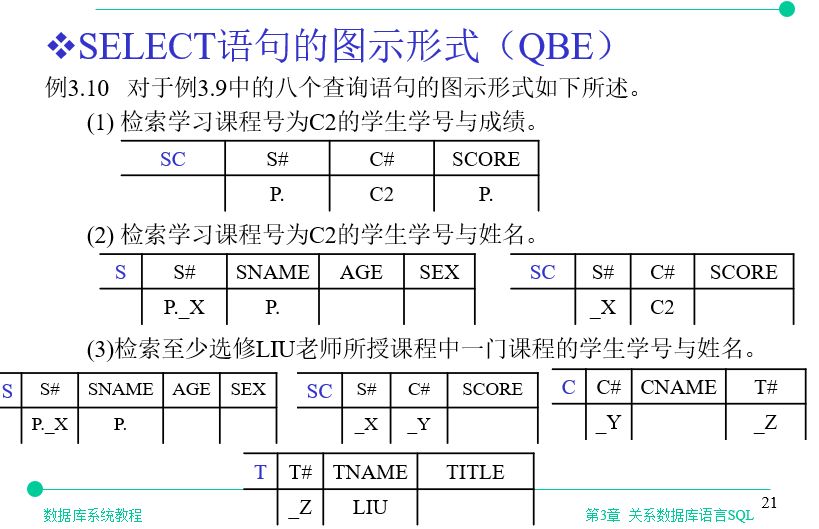
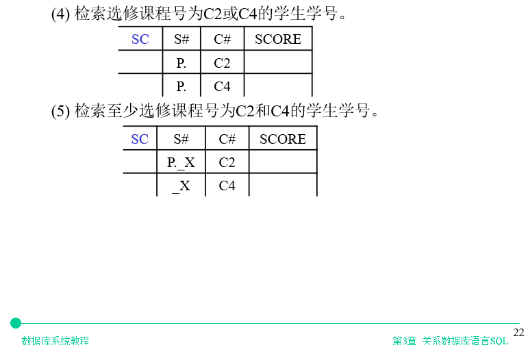
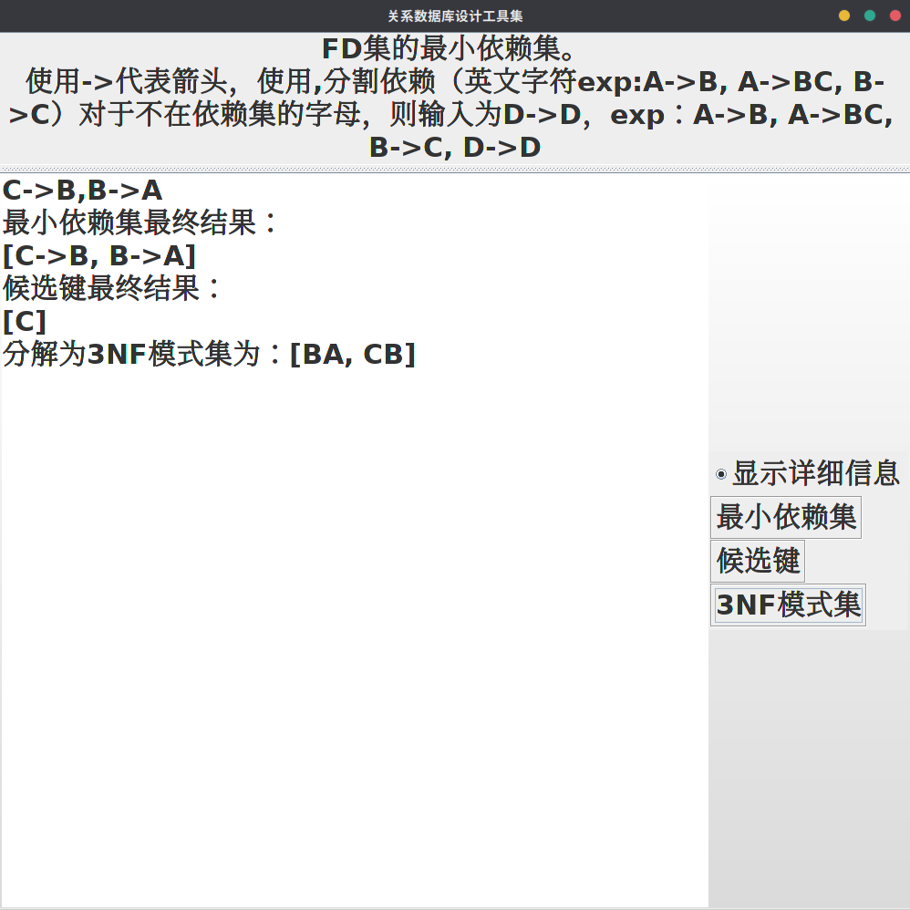
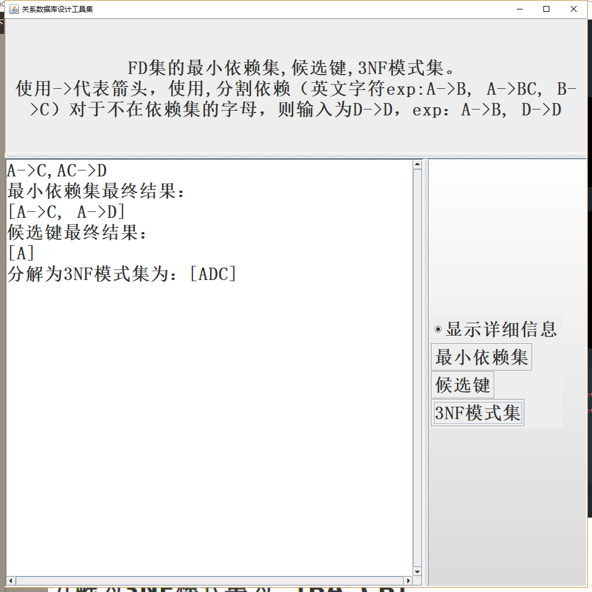
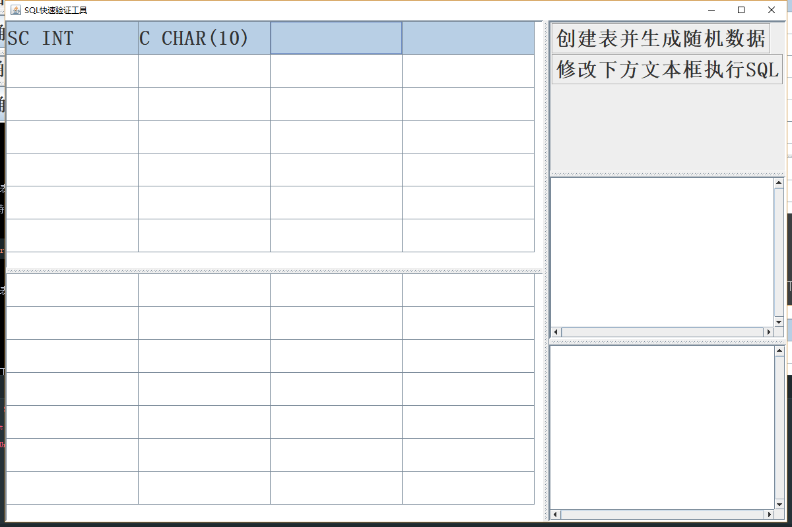
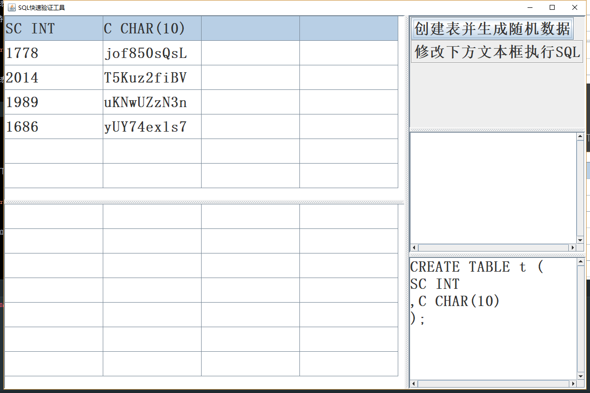
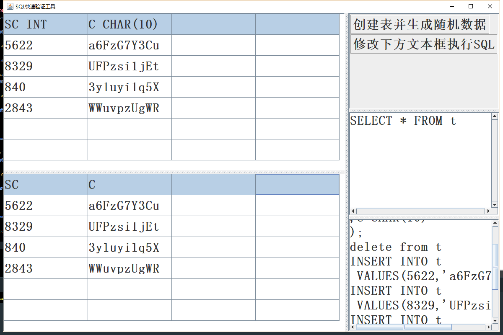

# SQL工具集

源码网址: `https://github.com/Iamttp/SQLUtil`

## 1.概论
### 1.1 工具集简介

    面对日益复杂的数据库设计使用。准备推出一套帮助数据库设计、使用、测试人员的工具。
    该工具的一大亮点是界面简单易懂，且各个小工具间相互独立，彼此之间互不干扰。
    在设计该工具集时十分重视使用的便捷，免安装，解压可用，不需要连接、配置任何数据库。

### 1.2 工具集组成 
    
    数据库工具集的第一个工具为QBE查询工具集，一种简化SQL查询语句编写的工具。
    一大特点是支持多张表，可以较为方便的表达多个表的联结。
    它的特点是遵循部分QBE标准，可视化的进行SQL查询语句的生成，
    帮助数据库新手可视化生成SQL查询语句。

###

    数据库工具集的第二个工具为关系模型设计工具集，
    它提供的功能为：根据给出的函数依赖集，计算出该函数依赖集的最小依赖集、候选键、以及第三范式。
    它的特点是测试了很多数据，更加稳定,帮助数据库设计人员快速设计数据库。

###

    数据库工具集的第三个工具为快速测试SQL工具集，一种适合数据库新手快速练习SQL、老手快速测试SQL的高效SQL测试工具。
    它依赖于java内置的内存型数据库 hsqldb，帮助使用者在半自动的界面下快速使用、测试SQL。
    快速，方便，不需要手动安装、连接、配置数据库。

 
## 2. 设计思路及使用方法

### 2.1 整体界面：

    整个代码在Windows下的IDEA集成开发环境下编写，在Linux发行版Ubuntu下测试通过。图形界面库使用的是java的swing。
    为防止在设计过程中，界面代码和逻辑代码混杂，将各个功能模块抽象，放置于MyUtil包下，将可重用的界面模块，放置于MyUIUtil包下，使代码可扩展性增强。
   
### 

    代码特点为界面代码和逻辑代码尽可能分离，使用面向对象方法重用了很多界面组件。
    整体特点为界面简单易懂，且各个小工具间相互独立，彼此之间互不干扰。可同时运行多个工具，且运行快速方便。

 
### 2.2 第一个QBE查询工具:
 
* 使用方法: 

    按照QBE格式修改表格，然后点击结果，生成SQL语句。

* 主要原理: 

    定义了需要进行特殊处理的关键字，如SELECT、P.、_X、_Y等等，然后获取界面表格的字符串，组成一个二维的可变长字符串数组，传入解析函数对字符串进行解析处理，分段拼接SELECT、FROM、WHERE，并最终完成字符串的最后拼接，然后返回给界面，由界面的文本框进行显示。

### 2.3 第二个关系模型设计工具集:

* 使用方法: 
    
    输入函数依赖集，根据需要点击按钮生成结果。

* 主要原理: 
#
    第一步：对给定的函数依赖集检查格式，并进行初步的分割。
    第二步：将第一步分割结果传入最小依赖集求解函数。
    第三步：将第一步分割结果传入候选键求解函数。
    第四步：将二、三步结果传入3NF求解函数。

其中第二步又可分为：
#
    1. 函数依赖集的右边写为单属性形式。
    2. 考虑属性集的闭包，按照PPT所给算法进行计算验证，一旦发现冗余，立即清除冗余函数依赖。
    3. 针对A->C,AC->B等的特殊情况进行判断，用特定算法，进一步清除冗余。

其中第四步又可分为：
#
    1.得到最小依赖集并合并左属性相同的函数依赖。
    2.得到候选键，并判断候选键是否存在于最小依赖集，如果存在则不进行处理。否则加入3NF
    3.对最小依赖集和待加入候选键进行最后的整理。

### 2.4 第三个快速测试SQL工具集:
* 使用方法: 

# 
    1. 修改上方表格的第一行用于即将创建的表的列，规则为列名+空格+类型名，当前支持类型为` CHAR VARCHAR BIT FLOAT INT `，相当于简化了CREATE;
    2. 点击“创建表并生成随机数据”按钮，则直接根据定义的表的类型生成待测试的随机数据（可以多次点击生成不同数据）
    3. （可选） 直接在上方表格修改数据，修改的数据会自动提交，相当于简化了UPDATE、DELECT、INSERT。
    4. 在下方文本框，填入你想执行的SQL语句，然后点击“修改下方文本框执行SQL”按钮, 注意表的名字为t(暂时只支持一张表)，完美支持SELECT语句，并将SELECT结果显示在下方表格
 

* 主要原理
#
    使用java内置的内存型数据库 hsqldb，帮助用户获得快速真实的SQL语句测试体验。
    1. 点击第一个按钮时。根据上方表格第一行列名及类型，传入第一行的字符串数组到工具函数，并进行字符串拼接，CREATE数据库表。相当于将CREATE语句用可视化方式结合起来。
    2. 点击第二个按钮时。重新读取上方表格数据（这样可以让用户在表格上的修改得到实现），然后delete from t 清空表t中的所有数据，并根据列的数据类型，生成不同的随机数据，字符串拼接生成INSERT语句（字符数据自动加引号）将随机数据插入表格，最后执行输入框的SQL语句，将结果返回到下方表格中进行显示。将使用频繁的SELECT语句完全自由的让用户进行输入测试执行。

### SQL QBE生成sql语句软件

通过设置表格，自动生成SQL语句

大概使用见:

`https://blog.csdn.net/Jaihk662/article/details/80081717`

基本功能0.2(如下图 版本0.2完成 (1)):

功能1.0（加入多张表，笛卡尔积 版本1.0完成 (1)(2)(3)）

TODO 小问题：

1. 界面不够友好
2. 符号>,<,=后面没有加引号
   
TODO 待解决问题 ：

1. 输出格式存在空格问题（有时会没有空格隔开）
2. 没有考虑或运算（OR）(这个。。。)

### SQL 关系模型设计工具集

完成了最小依赖集求解, 候选集

正则表达式在线测试：
`http://tool.oschina.net/regex/`

// 冗余及时清除已解决
> A->C,C->A,B->A,B->C,D->A,D->C,BD->A
> 
> 单属性去重为：[A->C, C->A, B->A, B->C, D->A, D->C, BD->A]
> 
> 最小依赖集最终结果：
> 
> [A->C, C->A, B->C, D->C]
> 
> 候选键 BD

// 该情况已解决
> A->B,B->C,AB->C
> 
> 最小依赖集最终结果：
> 
> [A->B, B->C]
> 
> 候选键 A

// 该情况已解决
> A->BC,CD->E,B->D,E->A
> 
> 候选键 A,CD,BC,E

// **左冗余** 已解决 影响到3NF求解
> A->C,AC->D
> 
> 最小依赖集最终结果：
> 
> [A->C, AC->D]
>
> 候选键 A

// AB->DE,B->DE,C->C
> 最小依赖集最终结果：
> 
> [B->D, B->E]
> 
> 候选键最终结果：
> 
> [ABC]
> 
> 分解为3NF模式集为：[BED, ABC]

// A->B,C->D,E->E
> 最小依赖集最终结果：
> 
> [A->B, C->D]
> 
> 候选键最终结果：
> 
> [ACE]
> 
> 分解为3NF模式集为：[AB, CD, ACE]

### SQL 快速测试SQL工具

优点：

        内置了java的内存型数据库 hsqldb
        快速，方便，不需要安装配置数据库
        将初始化数据尽可能做到了全自动
        适合数据库新手快速练习SQL
        适合老手快速测试SQL
            
缺点：
        
        不够稳定，支持类型较少，没考虑NULL
        暂时支持一张表
        执行SQL时，没有完美支持UPDATE\INSERT语句测试（一种方法是直接采用下方第三步,可视化修改）

使用方法

1. 修改上方表格的第一行用于定义表的列，规则为列名+空格+类型名
    当前支持类型为` CHAR VARCHAR BIT FLOAT INT `;
    

2. 点击创建表并生成随机数据则直接根据类型生成测试的随机数据

3. （可选） 直接在上方表格修改数据，会自动提交

4. 点击修改下方文本框执行SQL, 表的名字为t, 暂时较完美支持SELECT，并显示在下方表格

// TODO 添加按钮完成非SELECT语句的执行和表格显示