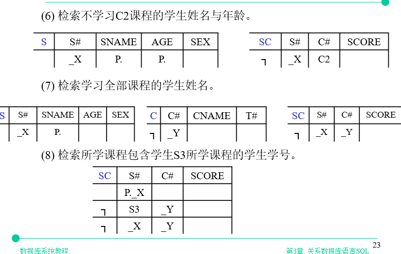
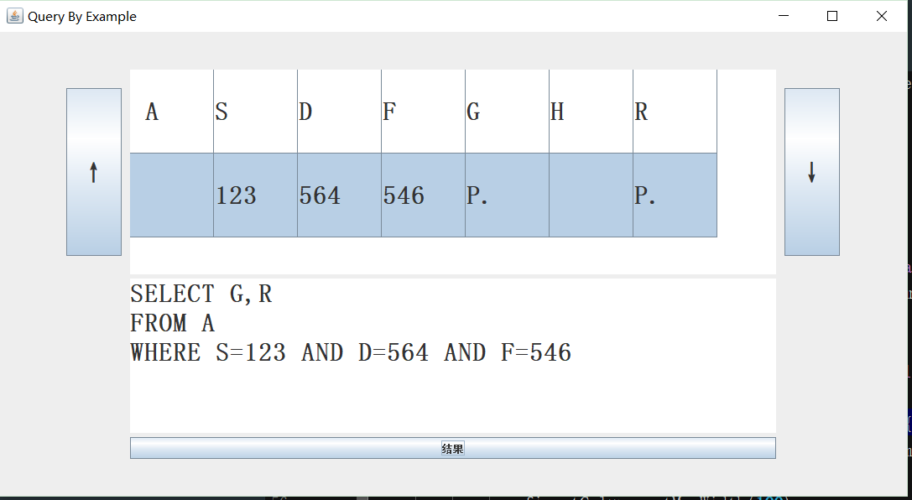
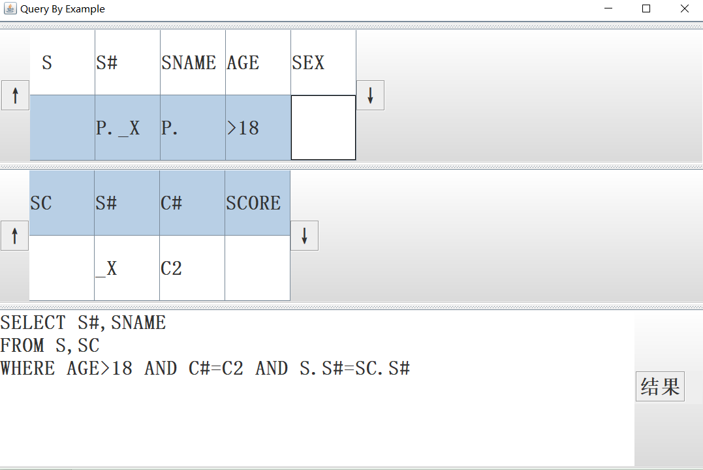

# SQL可视化软件

通过设置表格，自动生成SQL语句

大概使用见:

`https://blog.csdn.net/Jaihk662/article/details/80081717`

基本功能0.2(如下图 版本0.2完成 (1)):

功能1.0（加入多张表，笛卡尔积 版本1.0完成 (1)(2)(3)）

小问题：

1. 界面不够友好
2. 符号>,<,=后面没有加引号
   
待解决问题：

1. 输出格式存在空格问题（有时会没有空格隔开）
2. 没有考虑或运算（OR）(这个。。。)